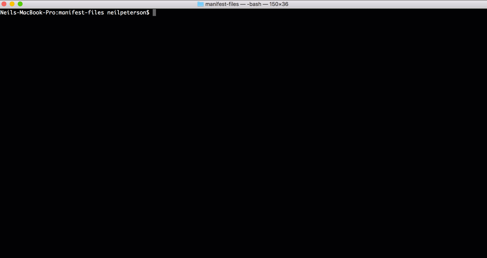

# Kubernetes burst scheduler

Simple scheduler that will burst workload to a named node after a specified number of related pods have been started.

Short two minute demo – this is also available on [youtube.com](https://youtu.be/GgYJM3dRURg), which may be easier to view from the beginning, pause, etc. 



## Attribution

This is my first go project and first exposure to the Kubernetes go client. Throughout, these two resources have been invaluable. Many thanks to the contributing teams.

- [Joe Beda controller sample](https://github.com/jbeda/tgik-controller)
- [Tu Nguyen kubewatch example / blog](https://engineering.bitnami.com/articles/kubewatch-an-example-of-kubernetes-custom-controller.html)

## Example use case:

**Environment:**

You have a Kubernetes cluster with three nodes. [Virtual Kublet](https://github.com/virtual-kubelet/virtual-kubelet) has been configured to present Azure Container Instances as a virtual node on the cluster. The cluster looks like this:

```
NAME                                   STATUS    ROLES     AGE       VERSION
aks-nodepool1-34059843-0               Ready     agent     9h        v1.7.7
aks-nodepool1-34059843-1               Ready     agent     9h        v1.7.7
aks-nodepool1-34059843-2               Ready     agent     9h        v1.7.7
virtual-kubelet-myaciconnector-linux   Ready     agent     2m        v1.8.3
```

A batch processing routine automatically starts Kubernetes jobs on the Kuebrentes. On average, less than 10 of these jobs are running at any given time. Occasionally an event occurs that temporarily increases this workload above 10 concurrent jobs. 

You would like to primarily run all jobs on the Kubernetes nodes, however when the number of concurrent jobs increases above 10, these pods should be scheduled on Azure Container Instances by the virtual kublet.

With these desired results, the Kubernetes Burst Scheduler can be used to burst job 11, 12, ... to the `virtual-kubelet-myaciconnector-linux` node.

## Starting the scheduler

The following manifest can be used to start the scheduler. Update `<node-name>` with the name of the burst node, and `<integer>` with the burst value. See the arguments section for details on all possible arguments.

```yaml
apiVersion: apps/v1beta1
kind: Deployment
metadata:
  name: burst-scheduler
spec:
  replicas: 1
  template:
    metadata:
      labels:
        app: burst-scheduler
    spec:
      containers:
      - name: kubectl-sidecar
        image: neilpeterson/kubectl-proxy-sidecar
      - name: burst-scheduler
        image: neilpeterson/burst-scheduler:v1
        args: ["--burstNode", "<node-name>", "--burstValue", "<integer>"]
```

Arguments:

The following arguments can be used when starting the scheduler.

| Argument | Type | Description |
|---|---|---|
| burstNode | String | Node name of the burst node. This is the node on which pods are scheduled once the burstValue has been met. |
| burstValue | Int | Value that controls how many pods will be scheduled on Kubernetes nodes vs. burst node. |
| namespace | String | Kubernetes namespace. |
| kubeConfig | Bool | Indicates that a kubernetes config file found at $KUBECONFIG is used for cluster discovery / auth. If not specified, it is assumed execution is occurring from a pod in the Kubernetes cluster. |
| schedulerName | String | The name of the scheduler, this will match the named scheduler when deploying pods. The default value os burst-scheduler. |

## Pod configuration

To manage burst scheduling across a set of related pods, two things need to be in place.

-	Scheduler name – when using a custom scheduler, the scheduler name must be specified in the pod manifest. In the following example, a name is `burst-scheduler`. This is the default name of the burst scheduler. This name is configurable when starting the scheduler, see the section on starting the scheduler.
-	App label – labels are used to group related pods for calculating weight and distribution. Currently the label must have a name of `app`. All pods that have this label will be grouped on the label value. In the following example the value of `aci-helloworld` is used to group and calculate pod placement. 


```yaml
apiVersion: apps/v1beta1
kind: Deployment
metadata:
  name: aci-helloworld
spec:
  replicas: 2
  template:
    metadata:
      labels:
        app: aci-helloworld
    spec:
      schedulerName: burst-scheduler
      containers:
      - name: aci-helloworld
        image: microsoft/aci-helloworld
        ports:
        - containerPort: 80
```